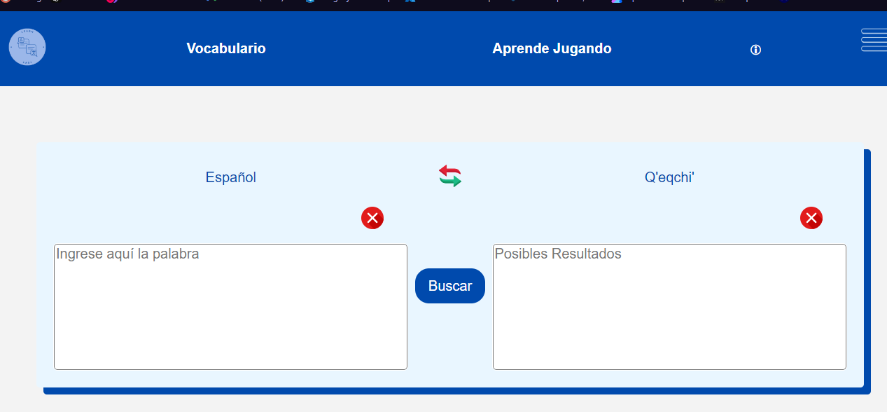
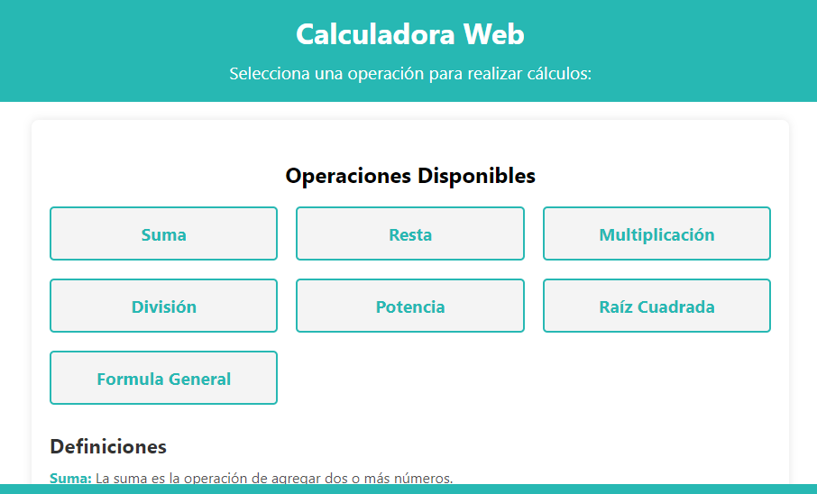

<h1 align="center">Hola 👋, soy Pedro Quiñonez ✨</h1>

  

  

 
<h2 align="left">Sobre mí 😃</h2>

🎓 ESTUDIANTE DE INGENIERIA EN SISTEMAS CURSANDO EL OCTAVO SEMESTRE  
Soy un desarrollador web Front-end. Me intereso por crear aplicaciones web atractivas, utilizando diferentes tecnologías como HTML, CSS y JavaScript. Busco mejorar mis habilidades y participar en nuevos retos y oportunidades.

### Skills

<h2 align="left">Latest YouTube Videos 🎥</h2>
<table>
  <tr>
    <td align="center">
      <a href="https://pedrojql.github.io/TRADUCTOR_Q/" target="_blank">
        
        
<b>TRADUCTOR DE QEQCHI</b>

      </a>
    </td>
    <td align="center">
      
      
<b>TRADUCTOR DE QEQCHI</b>

    </td>
  
  </tr>
</table>

